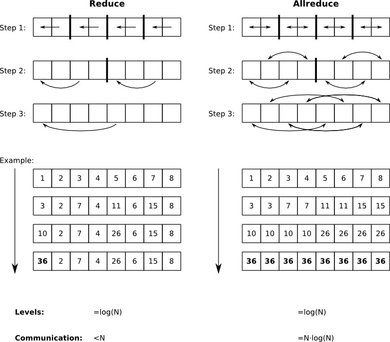

# Objectives

Basic implementations of MPI_Reduce and MPI_Allreduce. Changes:

# Running

After building with CMake run the program with the following command:

``` bash
$ mpirun -np 4 ./BONSAI scenarios/conf.xml
``` 
with 
* 4 being the number of MPI-processes (np) - it has to be a power of 2. 

# Reduce


